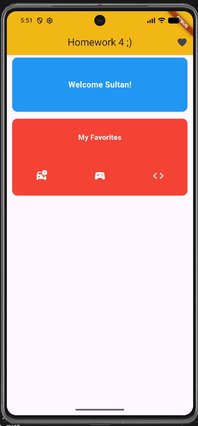

# Homework 4 - Flutter UI (Day 4)

A simple Flutter app that demonstrates building a basic user interface using fundamental Flutter widgets.
The screen includes an AppBar, Containers, Column, Row, Text, and Icons.

---

## ✅ Requirements Covered

The app includes:
- **AppBar** (with multiple parameters)
- **Column**
- **Row**
- **Container**
- **Text**

---

## 📁 Project Structure

| Path | Description |
|------|-------------|
| `lib/main.dart` | Runs the app and sets `HomeScreen` as the home widget |
| `lib/home_screen.dart` | Contains the UI (AppBar + Column/Row + Containers + Text) |

---

## 🖼️ App Screenshot

Below is a screenshot of the application after running it:



---

## ⚙️ How to Run

1.  Install dependencies:

    ``` bash
    flutter pub get
    ```

2.  Run the project:

    ``` bash
    flutter run
    ```

---

## ✨ Notes

-   The UI is built using basic Flutter widgets only.
-   The AppBar uses multiple parameters such as `title`, `centerTitle`, `actions`, and `elevation`.

---

## 👤 Author

**Sultan**
